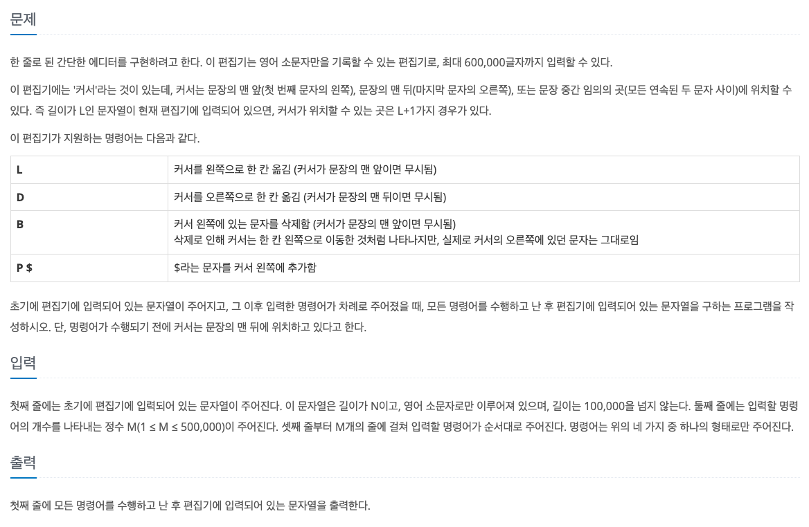

# 알고리즘 기초 1/2
- [BaekJoon - 알고리즘 기초(1/2)](https://code.plus/course/41)
- [1. 자료구조](#1-자료구조)
> 스택, 큐, 덱
- [2. 수학](#2-수학)
> GCD, LCM, 에라토테네스의 체, 팩토리얼, n*n 정사각형 개수, 진법변환
- [3. DP](#3-dp)
> 2친수, 1로 만들기, 합분해 

------------------------------------------------------------------------------------------
## 1. 자료구조
------------------------------------------------------------------------------------------
### [스택 - 10828](https://github.com/kazean/algorithm/blob/main/src/main/java/baekjoon/basic1/datastructure/Stack_Main_10828.java)
```java
Stack<Integer> stack = new Stack<>();
```
- class
```java
public
class Stack<E> extends Vector<E> {
    public E push(E item){}
    public synchronized E pop(){}
    public synchronized E peek(){}
    public boolean empty(){}
    public synchronized int search(Object o){}
}
```

------------------------------------------------------------------------------------------
### [큐 - 10845](https://github.com/kazean/algorithm/blob/main/src/main/java/baekjoon/basic1/datastructure/Queue_Main_10845.java)
```java
LinkedList<Integer> q = new LinkedList<>();
```
- class
```java
public interface Queue<E> extends Collection<E> {
    boolean add(E e);
    boolean offer(E e);
    E remove();
    E poll();
    E peek();
}

public class LinkedList<E>
        extends AbstractSequentialList<E>
        implements List<E>, Deque<E>, Cloneable, java.io.Serializable {
    
}
```
> LinkedList 로 구현

------------------------------------------------------------------------------------------
### [덱/데크 - 10845](https://github.com/kazean/algorithm/blob/main/src/main/java/baekjoon/basic1/datastructure/Deque_Main_10866.java)
```java
ArraysDeque<T> deque = new ArraysDeque<>();
Deque<T> dq = new LinkedList<>();

dq.addFirst(E), addLast(E), E poll~(), E peek~()

```

------------------------------------------------------------------------------------------
### [스택 - 에디터 - 1406](https://github.com/kazean/algorithm/blob/main/src/main/java/baekjoon/basic1/datastructure/Stack_uses5_Main_1406.java)

> - ListIterator or Stack 이용 
> > - [참고](https://minhamina.tistory.com/18)
```java
    LinkedList<Character> list = new LinkedList<>();
    for (int i = 0; i < initStr.length(); i++) {
        list.add(initStr.charAt(i));
    }

    ListIterator<Character> iter = list.listIterator();
    while (iter.hasNext()) {
        iter.next();
    }

    int idx = list.size();

    int cmdCnt = Integer.parseInt(br.readLine());

    for (int i = 0; i < cmdCnt; i++) {
        String s = br.readLine();
        char c = s.charAt(0);
        if ('P' == c) {
            char t = s.charAt(2);
            iter.add(t);
        } else if ('L' == c) {
            if(iter.hasPrevious()) iter.previous();
        } else if ('D' == c) {
            if(iter.hasNext()) iter.next();
        } else if ('B' == c) {
            if (iter.hasPrevious()) {
                iter.previous();
                iter.remove();
            }
        }
    }
```

------------------------------------------------------------------------------------------
### [스택 - 단어뒤집기 - 9093](https://github.com/kazean/algorithm/blob/main/src/main/java/baekjoon/basic1/datastructure/Stack_uses1_Main_9093.java)
입력된 문자열 역순 출력
> !보통 Stack Uses 시간초과...
> > StringTokenizer or Stream + StringBuffer or BufferedWriter 활용

------------------------------------------------------------------------------------------
### [스택 - 괄호 - 9012](https://github.com/kazean/algorithm/blob/main/src/main/java/baekjoon/basic1/datastructure/Stack_uses2_Main_9012.java)
올바른 괄호인지
> Stack Uses

------------------------------------------------------------------------------------------
### [큐 - 요세푸스(조세퍼스) 문제 - 1158](https://github.com/kazean/algorithm/blob/main/src/main/java/baekjoon/basic1/datastructure/Queue_uses_Main_1158.java)
원에 인원 N명 K번째 사람 추출
> Queue poll/add() 반복

------------------------------------------------------------------------------------------
### [덱 - 덱 - 10866](https://github.com/kazean/algorithm/blob/main/src/main/java/baekjoon/basic1/datastructure/Deque_Main_10866.java)
> ArrayDequeue

------------------------------------------------------------------------------------------


## 자료구조 1 (연습)
------------------------------------------------------------------------------------------
### [스택 - 단어뒤집기2 - 17413](https://github.com/kazean/algorithm/blob/main/src/main/java/baekjoon/basic1/datastructure/Stack_Prac_Main_17413.java)
단어 뒤집기, 태그(<, >)는 그대로 출력
> StringBuffer, Stack Uses

------------------------------------------------------------------------------------------
### [스택 - 쇠막대기 - 10799](https://github.com/kazean/algorithm/blob/main/src/main/java/baekjoon/basic1/datastructure/Stack_Prac_Main_10799.java)
쇠막대기와 레이저 배치를 나타내는 괄호표현이 공백 없이 주어진다 > 잘려진 조각의 총 개수 구하기
> Stack Uses: 괄호 여닫는 것의 개수

------------------------------------------------------------------------------------------
### [스택 - 오큰수 - 17298](https://github.com/kazean/algorithm/blob/main/src/main/java/baekjoon/basic1/datastructure/Stack_Prac_Main_17298_99.java)
- 오큰수
> 자신보다 오른쪽에 있는 수 중에 첫번째로 큰 수
> > 일반적인 구현으로는 `시간초과`
> > > Stack을 활용해서 기존 수열 점진적으로 변화
```java
for (int i = 0; i < arrs.length; i++) {
    while (!stack.isEmpty() && arrs[stack.peek()] < arrs[i]) {
        arrs[stack.pop()] = arrs[i];
    }
    stack.push(i);
}

while (!stack.isEmpty()) {
    arrs[stack.pop()] = -1;
}
```
> Stack: index, 기존배열 > 결과값 저장

------------------------------------------------------------------------------------------
### [스택 - 오등큰수 - 17299](https://github.com/kazean/algorithm/blob/main/src/main/java/baekjoon/basic1/datastructure/Stack_Prac_Main_17299.java)
- 오등큰수
> 자신보다 오른쪽에 있는 수중에서 빈도수가 첫번째로 큰 수
> > 오큰수와 같은 로직


------------------------------------------------------------------------------------------
## 자료구조 1 (참고)
------------------------------------------------------------------------------------------
### [스택 - 후위 표기식2 - 1935](https://github.com/kazean/algorithm/blob/main/src/main/java/baekjoon/basic1/datastructure/Stack_Ref_Main_1935.java)
- 후위표기식 계산하기
> Stack 을 이용해서 연산자 나올대마다 pop()하여 계산하기
> > String.format("%.2f". double)

------------------------------------------------------------------------------------------
### [스택 - 후위 표기식 - 1918](https://github.com/kazean/algorithm/blob/main/src/main/java/baekjoon/basic1/datastructure/Stack_Ref_Main_1918_99.java)
- !후위 표기식 만들기 (답안 확인)
> 연산식 우선순위에 따라서 결과 Push
> > 숫자는 append, 결과는 Stack 에서 풀기
```java
public static void main(String[] args) throws IOException {
    BufferedReader br = new BufferedReader(new InputStreamReader(System.in));
    String exp = br.readLine();
    
    Stack<Character> stack = new Stack<>();
    StringBuffer sb = new StringBuffer();
    for (int i = 0; i < exp.length(); i++) {
        char tmp = exp.charAt(i);

        switch (tmp) {
            case '+':
            case '-':
            case '*':
            case '/':
                // 이전 연산자가 우선인 경우, 먼저 stack 에 있는 경우를 먼저 append 후 새로운 연산자를 push
                while (!stack.isEmpty() && priority(stack.peek()) >= priority(tmp)) {
                    sb.append(stack.pop());
                }
                stack.push(tmp);
                break;
            case '(':
                // 괄호의 경우 stack 에 push
                stack.push(tmp);
                break;
            case ')':
                // 괄호가 끝나는 경우 stack 에 있는 경우를 append
                while (!stack.isEmpty() && stack.peek() != '(') {
                    sb.append(stack.pop());
                }
                stack.pop();
                break;
            default:
                sb.append(tmp);
        }
    }

    while (!stack.isEmpty()) {
        sb.append(stack.pop());
    }
    System.out.println(sb.toString());

}
```
> 알고리즘 구조를 어떻게 진행해야할지 더 고민하기
> > 처음든 생각 괄호 기준으로 만들기 > but 연산자나 우선순위를 생각하여 식을 stack 으로 표현하기


------------------------------------------------------------------------------------------
### [문자열/구현 - 알파벳 개수 - 10808](https://github.com/kazean/algorithm/blob/main/src/main/java/baekjoon/basic1/datastructure/StringNImpl_Ref_Main_10808.java)
- 알파벳 개수
> - 입력: 소문자 문자열
> - 출력: 해당 알파벳 개수 출력
> > 해당 문자열에 해당하는 배열 count++
```java
public static void main(String[] args) throws IOException {
    BufferedReader br = new BufferedReader(new InputStreamReader(System.in));
    String inputs = br.readLine();
    int[] result = new int[26];
    // a: 97, z: 122

    for (int i = 0; i < inputs.length(); i++) {
        char tmp = inputs.charAt(i);
        int index = tmp - 97;
        result[index] += 1;
    }

    StringBuffer sb = new StringBuffer();
    for (int i = 0; i < result.length; i++) {
        if (i == result.length - 1) {
            sb.append(result[i]);
        } else {
            sb.append(result[i]);
            sb.append(" ");
        }
    }
    System.out.println(sb.toString());
}
```
> - 속도 index를 한번에 계산 result[inputs.charAt(i) - 97]


------------------------------------------------------------------------------------------
### [문자열/구현 - 알파벳 찾기 - 10809](https://github.com/kazean/algorithm/blob/main/src/main/java/baekjoon/basic1/datastructure/StringNImpl_Ref_Main_10809_99.java)
- 알파벳 찾기
> - 입력: 소문자 문자열
> - 출력: a~z index, defaultIfEmpty: -1
> > 전체를 -1로 둔 상태에서 입력값 forEach 해당 index 입력(-1일 경우만)
```java
public static void main(String[] args) throws Exception {
    BufferedReader br = new BufferedReader(new InputStreamReader(System.in));
    char arr[] = br.readLine().toCharArray();
    int num[] = new int[26];
    for (int i = 0; i < 26; i++) {
        num[i] = -1;
    }

    for (int i = 0; i < arr.length; i++) {
        int loc = arr[i] - 97;


        if (num[loc] == -1) {
            num[loc] = i;
            //System.out.println(arr[i] + " = "+loc);

        }
    }
    for (int i = 0; i <  26; i++) {
        System.out.print(num[i] + " ");
    }
}
```

------------------------------------------------------------------------------------------
### [문자열/구현 - 문자열 분석 - 10820](https://github.com/kazean/algorithm/blob/main/src/main/java/baekjoon/basic1/datastructure/StringNImpl_Ref_Main_10820.java)
- 문자열 분석
> - 입력: 문자열, 길이( 1<= N <= 100)
> - 출력: 소문자, 대문자, 숫자, 공백 개수 출력
```java
public static void main(String[] args) throws IOException {
    BufferedReader br = new BufferedReader(new InputStreamReader(System.in));

    StringBuffer sb = new StringBuffer();
    while (true) {
        String tmp = br.readLine();
        if (tmp == null || "".equals(tmp)) {
            break;
        }
        int smallLetterCount, capitalLatterCount, numberCount, spaceCount;
        smallLetterCount = capitalLatterCount = numberCount = spaceCount = 0;
        for (int i = 0; i < tmp.length(); i++) {
            char c = tmp.charAt(i);
            if ('a' <= c && 'z' >= c) {
                smallLetterCount++;
            } else if ('A' <= c && 'Z' >= c) {
                capitalLatterCount++;
            } else if ('0' <= c && '9' >= c) {
                numberCount++;
            } else {
                spaceCount++;
            }
        }
        sb.append(smallLetterCount+ " " + capitalLatterCount + " " + numberCount + " " + spaceCount + "\n");
    }
    System.out.print(sb.toString());
}
```
------------------------------------------------------------------------------------------
### [문자열/구현 - 단어 길이 재기 - 2743](https://github.com/kazean/algorithm/blob/main/src/main/java/baekjoon/basic1/datastructure/StringNImpl_Ref_Main_2743.java)
- 단어 길이 제기
> - 입력: pulljima
> - 출력: 8
------------------------------------------------------------------------------------------
### [문자열/구현 - ROT13 - 11655](https://github.com/kazean/algorithm/blob/main/src/main/java/baekjoon/basic1/datastructure/StringNImpl_Ref_Main_11655.java)
- ROT13
> 암호화, 복호화: 문자열 + 13
> - 입력: Baekjoon Online Judge 
> - 출력: Onrxwbba Bayvar Whqtr
```java
public static void main(String[] args) throws IOException {
    BufferedReader br = new BufferedReader(new InputStreamReader(System.in));
    String str = br.readLine();
    StringBuffer sb = new StringBuffer();
    for (int i = 0; i < str.length(); i++) {
        char c = str.charAt(i);
        if (c >= 'a' && c <= 'z') {
            c = (char) (c + 13);
            if (c > 'z') {
                c = (char)(c - 26);
            }
        } else if (c >= 'A' && c <= 'z') {
            c = (char) (c + 13);
            if (c > 'Z') {
                c = (char)(c - 26);
            }
        }
        sb.append(c);
    }
    System.out.println(sb.toString());
}
```
> organize
> - String.charAt() 보다 toCharArrays해서 향상된 for문이 더빠르다
> - sout(sb)
------------------------------------------------------------------------------------------
### [문자열/구현/수학/사칙연산 - 네 수 - 10824]()
------------------------------------------------------------------------------------------
### [문자열/정렬 - 접미사 배열 - 11656]()
------------------------------------------------------------------------------------------


------------------------------------------------------------------------------------------
## 2. 수학
------------------------------------------------------------------------------------------
## [나머지](https://github.com/kazean/algorithm/blob/main/src/main/java/baekjoon/basic1/math/Divide_Main_10430.java)
------------------------------------------------------------------------------------------
### [최대공약수(GCD, Greatest Common Divisor), 최소공배수(LCM) - 2609](https://github.com/kazean/algorithm/blob/main/src/main/java/baekjoon/basic1/math/GcdLcd_Main_2609_99.java)
#### 최대공약수 - 유클리트 호제법
두 자연수가 공통으로 갖는 약수들 중에서 가증 큰 값 두 자연수들의 배수들 중에서 공통된 가장 작은수
- [참고](https://st-lab.tistory.com/154)
- 매커니즘
> 두 수 a, b 이고 r = a mod b  
이때 r은(0 <= r <= b)이고 a >= b이다.
> > 이때 a 와 b의 최대공약수를 (a, b)라고 할때 (a, b)의 최대 공약수는 (b, r)의 최대공약수 와 같다
> > 즉 GCD(a, b) = GCD(b, r) -> `재귀 반복` r = 0 일때까지
```java
// 반복문 방식
int gcd(int a, int b) {
	
	while(b != 0) {
		int r = a % b;
		a = b;
		b = r;
	}
	return a;
}
 
// 재귀 방식
int gcd(int a, int b) {
	if(b == 0) return a;
	return gcd(b, a % b);
}
```
#### 최소 공약수
두 자연수들의 배수들 중에서 공통된 가장 작은 수를 말한다.
```java
// 최소공배수 : Least Common mulitple
int lcm(int a, int b) {
	return a * b / gcd(a, b);
}
```
> 최소공배수 = 두 자연수의 곱 / 최대공약수  
a * b / gcd(a, b)
------------------------------------------------------------------------------------------
### [소수 - 에라토스테네스의 체 - 1929](https://github.com/kazean/algorithm/blob/main/src/main/java/baekjoon/basic1/math/Prime_Main_1929.java)
- [참고](https://firework-ham.tistory.com/8)
- 매커니즘
> 소수가 되는 수의 배수를 지우면 남은 건은 소수만 된다
```java
public static void prime() {
    prime[0] = prime[1] = true;

    for (int i = 0; i <= Math.sqrt(10001); i++) {
        if (!prime[i]) {
            for (int j = i * i; j <= 10000; j += i) {
                prime[j] = true;
            }
        }
    }
}
```
------------------------------------------------------------------------------------------
### [골드바흐의 추측 - 에라토스테네스의 체 - 6588](https://github.com/kazean/algorithm/blob/main/src/main/java/baekjoon/basic1/math/Prime_Goldbach_Main_6588.java)
------------------------------------------------------------------------------------------
### [팩토리얼 - 10872](https://github.com/kazean/algorithm/blob/main/src/main/java/baekjoon/basic1/math/Factorial_Main_10872.java)
------------------------------------------------------------------------------------------
### [조합 0의 개수 - 팩토리얼 끝 자리 0의 수 - 2004](https://github.com/kazean/algorithm/blob/main/src/main/java/baekjoon/basic1/math/ZeroCount_Main_2004.java)
- [참고](https://st-lab.tistory.com/165)
- 매커니즘
> 끝자리 0은 2, 5가 곱해져있을때다, 팩토리얼을 보면 5의 배수마다 5의 제곱의 지수 값이 1개씩 증가, 25는 카운트가 2개 증가
> > 즉 기본적으로 5의 개수에 따라 값이 변화한다고 보면 된다. 단순히 5로 나누면서 누적합
```java
public static int power5(int num) {
    int count = 0;
    while (num >= 5) {
        count += num / 5;
        num /= 5;
    }
    return count;
}

public static int power2(int num) {
    int count = 0;
    while (num >= 2) {
        count += num / 2;
        num /= 2;
    }
    return count;
}
```
> Math.min(power2(), power5())
------------------------------------------------------------------------------------------
### n*n 정사각형 개수
- [참고](https://blog.naver.com/neutrinoant/221274874006)
```java
int answer = (n-1)n*n(n+1)/12;
```
------------------------------------------------------------------------------------------
## 수학 1(연습)
------------------------------------------------------------------------------------------
### 진수 변환
- [참고](https://hianna.tistory.com/527)
- 매커니즘
> 10진수를 제외한 나머지 진수는 String으로 받아야 한다. -> int는 전부 10진수로 인식  
2진수, 8진수, 16진수는 아래와 같이 Binary, Octal, Hex함수가 존재한다.  
물론 toString(int n, int radix)로 사용해도 무관하다.
```java
public class Solution {
    public static void main(String[] args) {
        // 테스트를 위한 10진수 값 = 25
        int a = 25;

        System.out.println("10진수 -> 2진수");
        System.out.println(Integer.toBinaryString(a));
        System.out.println(Integer.toString(a,2));
        
        System.out.println("10진수 -> 3진수");
        System.out.println(Integer.toString(a,3));

        System.out.println("10진수 -> 8진수");
        System.out.println(Integer.toOctalString(a));
        System.out.println(Integer.toString(a,8));

        System.out.println("10진수 -> 16진수");
        System.out.println(Integer.toString(a,16));
        System.out.println(Integer.toHexString(a));
    }
}

public class Solution {
    public static void main(String[] args) {
        // 테스트를 위한 n진수 값 = 25
        String a = "110011";

        System.out.println("2진수 -> 10진수");
        System.out.println(Integer.parseInt(a,2));

        System.out.println("3진수 -> 10진수");
        System.out.println(Integer.parseInt(a,3));

        System.out.println("8진수 -> 10진수");
        System.out.println(Integer.parseInt(a,8));

        System.out.println("16진수 -> 10진수");;
        System.out.println(Integer.parseInt(a,16));
    }
}
```
> Integer.toString(int num, int radix) num(10) > radix
> Integer.parseInt(int num, int radix) radix > num(10)
------------------------------------------------------------------------------------------
## [2진수 8진수 = 1373](https://github.com/kazean/algorithm/blob/main/src/main/java/baekjoon/basic1/math/Binary2n8_Main_1373.java)
- [참고](https://hianna.tistory.com/527)


---------------------------------------------------------------------------------------
## 3. dp
------------------------------------------------------------------------------------------
### [1로 만들기](https://github.com/kazean/algorithm/blob/main/src/main/java/baekjoon/basic1/dp/Make1_Main_1463_99.java)
- 매커니즘
> 전체 경우를 배열로 둔다음 0~N 까지 경우의 수를 반복  
> 예외 케이스 10은 2로 나누는 것보다 -1뺀후 3으로 나누는 경우가 더 짧다
> > Math.min(dp[n/3], dp[n/2], dp[n-1])
```java
public static void main(String[] args) {
    Scanner sc = new Scanner(System.in);
    int size = sc.nextInt();
    int[] dp = new int[size+1];
    dp[0] = 1000001;
    dp[1] = 0;
    for(int i=2; i<=size; i++){
        int min = dp[0];
        if(i%3 == 0)
            min = Math.min(dp[i/3], min);
        if(i%2==0)
            min = Math.min(dp[i/2], min);
        if(i-1 !=0)
            min = Math.min(min, dp[i-1]);
        dp[i] = min+1;
    }
    System.out.println(dp[size]);
}
```
------------------------------------------------------------------------------------------
### [2친수](https://github.com/kazean/algorithm/blob/main/src/main/java/baekjoon/basic1/dp/BinaryNumber_Main_2193.java)
- 매커니즘
```text
0과 1로만 이루어진 수를 이진수라 한다. 
이러한 이진수 중 특별한 성질을 갖는 것들이 있는데, 이들을 이친수(pinary number)라 한다. 이친수는 다음의 성질을 만족한다.

1. 이친수는 0으로 시작하지 않는다.
2. 이친수에서는 1이 두 번 연속으로 나타나지 않는다. 즉, 11을 부분 문자열로 갖지 않는다.
```
> 점화식
```java
public static void main(String[] args) throws IOException {
    BufferedReader br = new BufferedReader(new InputStreamReader(System.in));
    N = Integer.parseInt(br.readLine());
    dp = new long[N + 1];
    dp[0] = 0;
    dp[1] = 1;

    for (int i = 2; i <= N; i++) {
        dp[i] = dp[i - 1] + dp[i - 2];
    }
    System.out.println(dp[N]);
    br.close();
}
```
------------------------------------------------------------------------------------------
### [합분해](https://github.com/kazean/algorithm/blob/main/src/main/java/baekjoon/basic1/dp/SumUp_Main_2225.java)
- 매커니즘
```text
0부터 N까지의 정수 K개를 더해서 그 합이 N이 되는 경우의 수를 구하는 프로그램을 작성하시오.
덧셈의 순서가 바뀐 경우는 다른 경우로 센다(1+2와 2+1은 서로 다른 경우). 또한 한 개의 수를 여러 번 쓸 수도 있다.
```
> 점화식 K-1개 수를 합해 만든 값 + 0 ~ N 까지의 정수를 더한다면 K-1개의 수로 만든 합에 1개의 정수를 더한 것이므로  
> K개의 수를 사용해 만든 어떤합이 될것이다.
- [참고](https://nahwasa.com/entry/%EB%B0%B1%EC%A4%80-2225-%EC%9E%90%EB%B0%94-%ED%95%A9%EB%B6%84%ED%95%B4-BOJ-2225-JAVA)
```java
for (int i = 1; i < N + 1; i++) {
    dp[i][1] = 1;
}
for (int i = 1; i < K + 1; i++) {
    dp[1][i] = 1;
}

for (int i = 1; i <= N; i++) {
    for (int j = 2; j <= K; j++) {
        dp[i][j] = (dp[i][j - 1] + dp[i - 1][j]) % mod;
    }
}
```
------------------------------------------------------------------------------------------
## DP1(연습)
------------------------------------------------------------------------------------------
### [1, 2, 3 더하기 3](https://github.com/kazean/algorithm/blob/main/src/main/java/baekjoon/basic1/dp/Plus123_Main_15988.java)
- 매커니즘
> - 정수를 1,2,3 합으로 나타내기
> 1, 2, 3 일때 경우의 수 dp[i-3] + dp[i-2] + dp[i-1]
```java
public class Plus123_Main_15988 {
    static long[] dp = new long[1000001];
    public static void main(String[] args) throws IOException {
        BufferedReader br = new BufferedReader(new InputStreamReader(System.in));
        int t = Integer.parseInt(br.readLine());
        dp();

        for (int i = 0; i < t; i++) {
            int num = Integer.parseInt(br.readLine());
            System.out.println(dp[num]);
        }
    }

    public static void dp() {
        dp[1] = 1;
        dp[2] = 2;
        dp[3] = 4;

        for (int i = 4; i <= 1000000; i++) {
            dp[i] = (dp[i-3] + dp[i-2]+ dp[i-1])  % 1000000009;
        }
    }
}
```
------------------------------------------------------------------------------------------
### [rgb 거리](https://github.com/kazean/algorithm/blob/main/src/main/java/baekjoon/basic1/dp/RGB_Main_1149_99.java)
- 매커니즘
```text
문제
RGB거리에는 집이 N개 있다. 거리는 선분으로 나타낼 수 있고, 1번 집부터 N번 집이 순서대로 있다.

집은 빨강, 초록, 파랑 중 하나의 색으로 칠해야 한다. 각각의 집을 빨강, 초록, 파랑으로 칠하는 비용이 주어졌을 때, 아래 규칙을 만족하면서 모든 집을 칠하는 비용의 최솟값을 구해보자.

1번 집의 색은 2번 집의 색과 같지 않아야 한다.
N번 집의 색은 N-1번 집의 색과 같지 않아야 한다.
i(2 ≤ i ≤ N-1)번 집의 색은 i-1번, i+1번 집의 색과 같지 않아야 한다.
```
> 문제를 보고 점진적으로 조건에 따른 현재 max 값을 dp에 저장하기
> > 17404 문제 경우, 각 결과 반복하여 dp 구하기
> > > 코드를 변경하기보다 문제에서 유추 필요
```java
// R, G, B 반복
public static void main(String[] args) throws NumberFormatException, IOException {
    BufferedReader br = new BufferedReader(new InputStreamReader(System.in));
    int n = Integer.parseInt(br.readLine());
    int[][] max = new int[n+1][3];
    max[0][0] = max[0][1] = max[0][2] = 0;
    int r, g, b;
    
    for(int i=0; i<n; i++){
        String tmpLine = br.readLine();
        String[] tmpArrLine = tmpLine.split(" ");
        r = Integer.parseInt(tmpArrLine[0]);
        g = Integer.parseInt(tmpArrLine[1]);
        b = Integer.parseInt(tmpArrLine[2]);
        max[i+1][0] = Math.min(max[i][1], max[i][2]) + r;
        max[i+1][1] = Math.min(max[i][0], max[i][2]) + g;
        max[i+1][2] = Math.min(max[i][0], max[i][1]) + b;
    }
    
    System.out.println(Math.min(Math.min(max[n][0], max[n][1]), max[n][2]));
}
```
------------------------------------------------------------------------------------------
## DP1(도전)
------------------------------------------------------------------------------------------
### [rgb 거리2](https://github.com/kazean/algorithm/blob/main/src/main/java/baekjoon/basic1/dp/RGB_Main_1149_99.java)
```java
public static void main(String[] args) throws IOException {
    n = Integer.parseInt(br.readLine());
    arr = new int[n + 1][3];
    dp = new int[n + 1][3];

    // 입력 값 저장
    for(int i = 1 ; i <= n; i++){
        StringTokenizer st = new StringTokenizer(br.readLine());
        for(int j = 0 ; j < 3; j++){
            arr[i][j] = Integer.parseInt(st.nextToken());
        }
    }

    // k = 0 -> RED, 1 -> GREEN, 2 -> BLUE로 첫 집을 칠하는 경우이다.
    for(int k = 0; k < 3; k++) {
        //RED, GREEN, BLUE로 칠하는 경우 각 색을 제외한 나머지는 INF로 초기화 해준다.
        for(int i = 0 ; i < 3; i++) {
            if(i == k) dp[1][i] = arr[1][i];
            else dp[1][i] = INF;
        }

        // 열의 값인 0 -> RED, 1 -> GREEN, 2 -> BLUE로 칠했을 때의 최소값을 의미한다.
        for (int i = 2; i <= n; i++) {
            dp[i][0] = Math.min(dp[i - 1][1], dp[i - 1][2]) + arr[i][0];
            dp[i][1] = Math.min(dp[i - 1][0], dp[i - 1][2]) + arr[i][1];
            dp[i][2] = Math.min(dp[i - 1][0], dp[i - 1][1]) + arr[i][2];
        }

        // 정답인 최솟값을 구하는 부분
        for(int i = 0 ; i < 3; i++)
            if(i != k) answer = Math.min(answer, dp[n][i]);
    }


    bw.write(answer + "\n");

    bw.close();
    br.close();
}
```